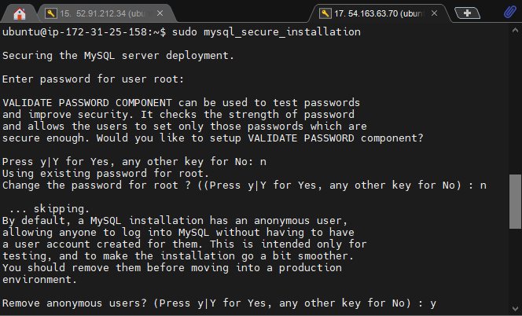
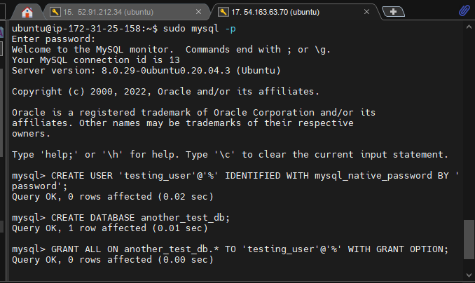
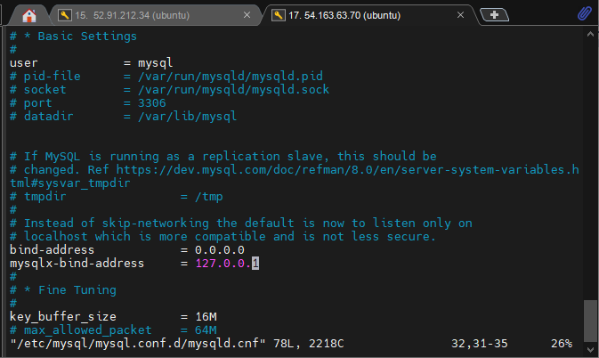
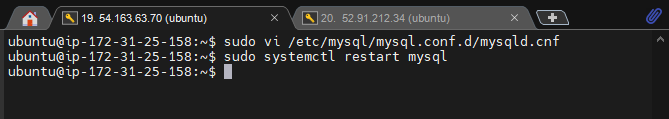
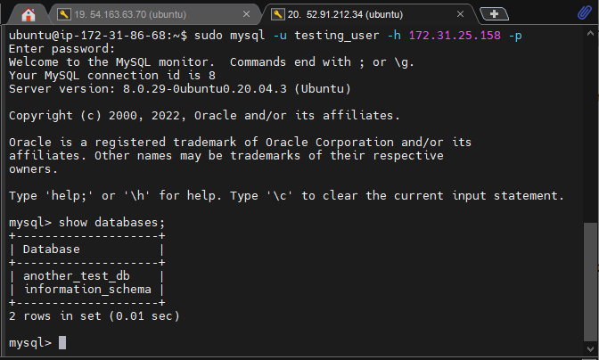

## A CLIENT SERVER ARCHITECTURE USING MYSQL DATABASE MANAGEMENT SYSTEM (DBMS).

### Securing MySQL

---

### Creating Database User And Test Database

---

### Configuring Mysql Bind Address

---

### Restarting Mysql

---

### Connecting Mysql Client And Mysql Server

---